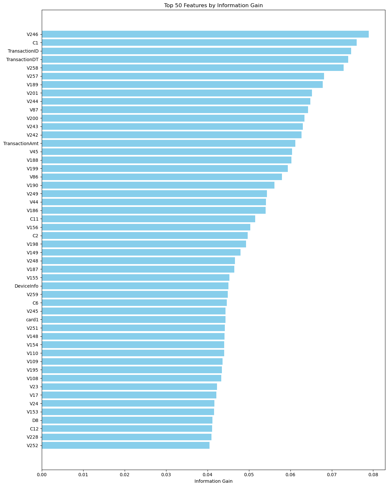

# Fraud Detection Pipeline

A **scalable machine learning pipeline** for detecting fraudulent transactions using advanced feature engineering and ensemble models.

---

## Table of Contents
1. [Project Overview](#overview)
2. [Objectives](#objectives)
3. [Pipeline Architecture](#pipeline-architecture)
4. [Implementation Steps](#implementation-steps)
   - [4.1 Setup and Imports](#41-setup-imports)
   - [4.2 Data Loading & Merging](#42-data-loading--merging)
   - [4.3 Exploratory Data Analysis](#43-exploratory-data-analysis)
   - [4.4 Feature Engineering and Imbalanced Data Handling](#44-feature-engineering)
   - [4.5 Bagging Techniques and Baseline Comparisons](#45-Bagging-Techniques-and-Baseline-Comparisons)
   - [4.6 Boosting Algorithms](#46-Boosting-Algorithms)
   - [4.7 Hybrid Models and Unsupervised Techniques](#47-Hybrid-Models-and-Unsupervised-Techniques)
   - [4.8 Final Evaluation and Pipeline Development](#48Final-Evaluation-and-Pipeline-Development)
6. [LOGICAL CONCLUSION](#LOGICAL-CONCLUSION)
7. [Learnings](#Learnings)

---

## Overview <a name="overview"></a>
This project is an **end-to-end fraud detection pipeline**, built to detect fraudulent transactions in large-scale financial data. The system combines:
- Classical supervised machine learning approaches
- Hybrid ensemble techniques
- Unsupervised anomaly detection methods

It is designed to ensure **high accuracy and robustness**, even in challenging, real-world scenarios using the IEEE-CIS Fraud Detection dataset.

---

## Objectives <a name="objectives"></a>
- Build a complete fraud detection pipeline from raw data to deployment-ready models
- Compare multiple supervised learning algorithms
- Explore hybrid models and unsupervised approaches
- Handle imbalanced datasets effectively
- Develop a **modular, reusable, and scalable code structure**

---

## Pipeline Architecture <a name="pipeline-architecture"></a>


## Steps from EDA to Pipeline

### 1. Exploratory Data Analysis (EDA)

- Examine class imbalance.
- Check feature distributions (histograms, KDE plots).
- Analyze correlations using heatmaps.

### 2. Data Cleaning

- Handle missing values via imputation or removal.
- Detect and remove outliers using Z-score or IQR methods.

### 3. Feature Engineering & Selection

- Create new features (e.g., transaction amount ratios).
- Encode categorical variables (e.g., one-hot, target encoding).
- Scale numerical features using StandardScaler or MinMaxScaler.
- Optionally, apply dimensionality reduction (e.g., PCA).

### 4. Model Selection & Training

- Start with baseline models (Logistic Regression, Decision Trees).
- Move to advanced models (Random Forest, XGBoost, LightGBM, CatBoost).
- Handle imbalanced data using SMOTE or class weighting.

### 5. Model Evaluation

- Use confusion matrix, classification report, and ROC curves.
- Compare precision, recall, and F1-score.
- Use cross-validation to assess generalization.

### 6. Pipeline Automation & Deployment

- Combine preprocessing and model into a `Pipeline` object.
- Serialize model using joblib or pickle.
- Integrate into an API or batch scoring pipeline.

---

## Implementation Steps <a name="implementation-steps"></a>


### 1. **Setup and Imports** <a name="41-setup-imports"></a>

#### Core Libraries

```python
import numpy as np
import pandas as pd
```
	•	NumPy: Fundamental package for numerical computations.
	•	Pandas: Data manipulation and analysis using DataFrames.

#### Visualization

```python
import matplotlib.pyplot as plt
import seaborn as sns
import shap
```
	•	Matplotlib & Seaborn: For plotting distributions, correlations, and evaluation metrics.
	•	SHAP: For interpreting and explaining model predictions (feature importance, SHAP values).

#### Preprocessing & Feature Engineering

```python
from sklearn.preprocessing import StandardScaler, LabelEncoder
from sklearn.decomposition import PCA
from sklearn.pipeline import Pipeline
from sklearn.feature_selection import SelectFromModel, mutual_info_classif
```
	•	StandardScaler: Scales features to mean 0 and variance 1.
	•	LabelEncoder: Encodes categorical labels numerically.
	•	PCA: Reduces dimensionality to simplify high-dimensional data.
	•	Pipeline: Combines preprocessing and modeling into one seamless workflow.
	•	SelectFromModel & mutual_info_classif: For feature selection and ranking feature importance.

 ####  Model Selection & Training
 
```python
from sklearn.linear_model import LogisticRegression
from sklearn.import DecisionTreeClassifier
from sklearn.ensemble import RandomForestClassifier, BaggingClassifier, StackingClassifier, GradientBoostingClassifier
from sklearn.neighbors import KNeighborsClassifier
from sklearn.svm import OneClassSVM
from sklearn.ensemble import IsolationForest
from sklearn.cluster import KMeans, DBSCAN
```
	•	Classical Models: Logistic Regression, Decision Trees, KNN.
	•	Ensemble Models: Random Forest, Bagging, Stacking, Gradient Boosting — help improve performance and reduce overfitting.
	•	Unsupervised Models: One-Class SVM, Isolation Forest, KMeans, DBSCAN — for anomaly detection and clustering fraudulent behavior.

#### Imbalanced Data Handling

```python
from imblearn.over_sampling import SMOTE
from imblearn.under_sampling import RandomUnderSampler
```
	•	SMOTE: Over-samples minority class to address imbalance.
	• RandomUnderSampler: Reduces majority class to balance the dataset.

#### Advanced Boosting Libraries

```python
import xgboost as xgb
import lightgbm as lgb
import catboost as cb
```
	•	XGBoost, LightGBM, CatBoost: Advanced gradient boosting frameworks known for excellent performance on structured data.

#### Utilities

```python
import pickle
import time
from pympler import asizeof
import warnings
warnings.filterwarnings('ignore')
```
	•	pickle: Serialize and save models for reuse or deployment.
	•	time: Track execution time for training or predictions.
	•	pympler.asizeof: Check memory usage of data or models.
	•	warnings.filterwarnings(‘ignore’): Suppresses warnings to keep notebook output clean (use with caution).
---

### 2. **Load Data**<a name="42-data-loading--merging"></a>

Below, we load the transaction and identity datasets and merge them to create a unified DataFrame for analysis.

```python
train_identity = pd.read_csv("/Users/roshanshetty/Downloads/PROJECT_PHASE_1/dataset/train_identity.csv")
train_transaction = pd.read_csv("/Users/roshanshetty/Downloads/PROJECT_PHASE_1/dataset/train_transaction.csv")

# Merge datasets on TransactionID
df = pd.merge(train_identity, train_transaction, on='TransactionID', how='left')
```
---

### 3. **EDA and Preprocessing**<a name="43-exploratory-data-analysis"></a>

<b>Objective:</b> Set the foundation for the project by exploring data in-depth and 
handling preprocessing challenges.

#### **Dataset Introduction**

After merging, we inspect the first few rows and data structure to understand the dataset shape and types.

```python
print(df.head())
print(df.info())
```
   | TransactionID | id_01 | id_02  | id_03 | id_05 | ....... | V331 |
|---------------|-------|--------|-------|-------|------|------|
| 2987004       | 0.0   | 70787  | NaN   | NaN  |....... |0.0  | 0.0 |
| 2987008       | -5.0  | 98945  | NaN   | 0.0  |....... | 0.0  | 0.0 |
| 2987010       | -5.0  |191631  | 0.0  | 0.0  |........ | NaN | NaN |
| 2987011       | -5.0  |221832  | NaN  | 0.0  |........ |NaN | NaN |
| 2987016       | 0.0   | 7460   | 0.0  | 1.0  |........ |0.0  | 0.0 |

[5 rows x 434 columns]
<class 'pandas.core.frame.DataFrame'>
RangeIndex: 144233 entries, 0 to 144232
Columns: 434 entries, TransactionID to V339
dtypes: float64(399), int64(4), object(31)
memory usage: 477.6+ MB
None

###  Transaction Dataset

The transaction dataset records various types of financial transactions, including money transfers, ticket bookings, and purchases. It contains the following key attributes:

1. **TransactionDT**: A time-delta value representing the time elapsed since a reference point, but not an actual timestamp.
2. **TransactionAMT**: The transaction amount in USD.
3. **ProductCD**: The product code associated with the transaction.
4. **card1 – card6**: Details related to the payment card used for the transaction.
5. **addr1 and addr2**: The purchaser's address information.
6. **dist1 and dist2**: The geographical distance between two transaction locations.
7. **P_emaildomain and R_emaildomain**: The email domains of the purchaser and recipient.
8. **C1 – C14**: Counts representing how many addresses are linked to the card.
9. **D1 – D15**: Time-based deltas indicating the number of days between consecutive transactions.
10. **M1 – M9**: Matching indicators, such as whether the cardholder's name matches the provided address.
11. **V1 – V339**: Entity relationship attributes provided by Vesta, capturing additional transaction details.

---

###  About V Features (V1 – V339)

**VXXX** columns represent information provided by **Vesta**, specifying various entity relationships.

#### Vesta-Engineered Features

Vesta is a fraud detection and payment processing company specializing in machine learning models for transaction risk assessment.  
The Vesta-engineered features (V1 to V339) are derived from raw transaction data to enhance fraud detection.

---

#### Types of Features in V1 to V339

- **Ranking-Based Features**  
  How a transaction compares to others (e.g., is this amount unusually high for this user?).  
  *Example*: Rank of transaction amount within a certain timeframe.

- **Counting-Based Features**  
  How often a particular entity (e.g., card, email, IP address) appears.  
  *Example*: Number of transactions from the same card in the past week.

- **Entity Relationship Features**  
  Connections between users, devices, locations, and payment methods.  
  *Example*: Is this IP address linked to multiple different cards?

- **Time-Series Features**  
  Trends in transaction behavior over time.  
  *Example*: Time gap between consecutive transactions for a user.

---

#### Why Are These Features Important?

- Detect unusual patterns that indicate fraud.
- Enhance model accuracy by encoding risk factors from raw transaction data.
- Help prevent fraud in real-time by identifying suspicious behaviors.

---
####  Exploratory Data Analysis (EDA)

A crucial first step in fraud detection is understanding the **class imbalance**, as fraudulent transactions are usually much rarer than genuine ones.  
Here, we visualize the distribution of fraud vs. non-fraud cases using bar and pie charts.

```python
# Bar plot to show class distribution
plt.figure(figsize=(6, 4))
sns.countplot(x='isFraud', data=df)
plt.title('Class Distribution (Bar Plot)')
plt.xlabel('Is Fraud')
plt.ylabel('Count')
plt.show()

# Pie chart to show class proportion
plt.figure(figsize=(6, 6))
df['isFraud'].value_counts().plot.pie(autopct='%1.1f%%', startangle=90, colors=['lightblue', 'salmon'])
plt.title('Class Distribution (Pie Chart)')
plt.ylabel('')
plt.show()
```
	•	The bar plot clearly shows the imbalance between fraudulent and non-fraudulent transactions, with fraud cases forming a very small fraction.
	•	The pie chart provides a proportional view, helping understand the severity of class imbalance visually.

 <p align="center">
  
  
</p>

**The dataset is highly imbalanced, with 92.2% non-fraudulent and 7.8% fraudulent transactions.**

---
#### Correlation of features


**-The heatmap shows strong correlations among some features, indicating possible multicollinearity.**

**-Several features have moderate to high correlation with the target (isFraud), making them important for modeling.**

**-Careful feature selection or dimensionality reduction may be needed to avoid redundancy and improve model performance.**


---

#### Distribution of continuous features

 <p align="center">
  
  
</p>
<p align="center">
  
  
</p>
<p align="center">
  
  
</p>
<p align="center">
  
  
</p>
<p align="center">
  
  
</p>
<p align="center">
  
  
</p>
<p align="center">
  
  
</p>

- **Most transactions are small**: TransactionAmt peaks below 250, with few above 1000.  
- **C1-C14 are sparse**: High counts near zero, sharp drop-off—likely categorical or encoded data.  
- **D-features vary**: Some (D2, D3) peak low; others (D8) spread wider—possibly time-related.  
- **Outliers present**: Long tails in TransactionAmt and D8 suggest rare high values needing handling.

---
### Data Preprocessing 

- **Number of outliers detected using Z-score: 89941**
- **Number of outliers detected using IQR: 141269**

<p align="center">
  
  

</p>

- **Dataset shape after preprocessing: (144233, 434)**
- **Outlier flags added to scaled DataFrame.**

---

### 4. Feature Engineering and Imbalanced Data Handling  <a name="44-feature-engineering"></a>

<b>Objective:</b> Engineer features and tackle imbalanced datasets.

#### Feature Engineering 

Below, we created new ratio-based features to enhance model learning:

```python
# Ratio of transaction amount to global mean
df['Amt_to_mean_ratio'] = df['TransactionAmt'] / (df['TransactionAmt'].mean() + 1)

# Ratio to user historical average (using card1 as proxy)
if 'card1' in df.columns:
    user_mean = df.groupby('card1')['TransactionAmt'].transform('mean')
    df['Amt_to_user_mean_ratio'] = df['TransactionAmt'] / (user_mean + 1)
```
- **These features capture how large a transaction is compared to the global average and the user’s historical average.**
- **This helps the model detect unusual spending behavior that may indicate fraud.**

---
#### Feature Selection

- <b> Information Gain </b>

Kept **420 numerical columns**, dropped **13** low-importance columns.

Below are the **Top 10 Features** by information gain:

| Rank | Feature        | Information Gain |
|-------|----------------|------------------|
| 1     | V246          | 0.0789           |
| 2     | C1            | 0.0760           |
| 3     | TransactionID| 0.0747           |
| 4     | TransactionDT| 0.0740           |
| 5     | V258          | 0.0729           |
| 6     | V65           | 0.0705           |
| 7     | V275          | 0.0690           |
| 8     | V30           | 0.0675           |
| 9     | V262          | 0.0662           |
| 10    | V263          | 0.0657           |

**Note:** The full analysis considered the **Top 100 features**, but for clarity, only the first 10 are shown here.




- <b>Fisher's Score</b>
Below are the **Top 15 features** ranked by Fisher Score.

| Rank | Feature | Fisher Score |
|-------|----------|-------------|
| 1   | V258    | 0.1671 |
| 2   | V242    | 0.1661 |
| 3   | V244    | 0.1659 |
| 4   | V257    | 0.1653 |
| 5   | V246    | 0.1519 |
| 6   | card3   | 0.1390 |
| 7   | V243    | 0.1340 |
| 8   | id_17   | 0.1332 |
| 9   | id_35   | 0.1331 |
| 10  | V189    | 0.1314 |
| 11  | V201    | 0.1286 |
| 12  | V230    | 0.1198 |
| 13  | V188    | 0.1182 |
| 14  | V200    | 0.1160 |
| 15  | V199    | 0.1098 |


- <b>Correlation Coefficient</b>

Below are the **Top 15 features** most strongly correlated with the fraud target variable:

| Rank | Feature      | Correlation |
|-------|-------------|-------------|
| 1   | V257        | 0.3628 |
| 2   | V246        | 0.3477 |
| 3   | V244        | 0.3454 |
| 4   | V242        | 0.3420 |
| 5   | V87         | 0.3302 |
| 6   | V201        | 0.3245 |
| 7   | V45         | 0.3245 |
| 8   | V86         | 0.3234 |
| 9   | V200        | 0.3154 |
| 10  | V189        | 0.3048 |
| 11  | V188        | 0.3002 |
| 12  | V44         | 0.2979 |
| 13  | V258        | 0.2851 |
| 14  | V228        | 0.2542 |
| 15  | V170        | 0.2474 |


- <b>Dispersion Ratio</b>

Below are the **Top 50 features** ranked by Dispersion Ratio.

| Rank | Feature | Dispersion Ratio |
|-------|-----------|-----------------|
| 1  | V133  | 1.8439 |
| 2  | V134  | 1.8438 |
| 3  | V127  | 1.8436 |
| 4  | V322  | 1.8434 |
| 5  | V132  | 1.8434 |
| 6  | V324  | 1.8433 |
| 7  | V128  | 1.8433 |
| 8  | V323  | 1.8430 |
| 9  | V126  | 1.8429 |
| 10 | V316  | 1.8429 |
| 11 | V331  | 1.8428 |
| 12 | V143  | 1.8428 |
| 13 | V332  | 1.8428 |
| 14 | V333  | 1.8425 |
| 15 | V293  | 1.8425 |
| 16 | V306  | 1.8423 |
| 17 | V279  | 1.8423 |
| 18 | V164  | 1.8422 |
| 19 | V211  | 1.8385 |
| 20 | V311  | 1.8335 |
| 21 | V202  | 1.8320 |
| 22 | V136  | 1.8310 |
| 23 | V329  | 1.8305 |
| 24 | V177  | 1.8296 |
| 25 | V308  | 1.8285 |
| 26 | V167  | 1.8280 |
| 27 | V179  | 1.8274 |
| 28 | V318  | 1.8271 |
| 29 | V178  | 1.8266 |
| 30 | V269  | 1.8252 |
| 31 | V165  | 1.8229 |
| 32 | V137  | 1.8228 |
| 33 | V213  | 1.8221 |
| 34 | V321  | 1.8206 |
| 35 | V168  | 1.8197 |
| 36 | V267  | 1.8185 |
| 37 | V280  | 1.8170 |
| 38 | V319  | 1.8170 |
| 39 | V338  | 1.8166 |
| 40 | V206  | 1.8163 |
| 41 | V135  | 1.8160 |
| 42 | V129  | 1.8146 |
| 43 | V295  | 1.8144 |
| 44 | V266  | 1.8141 |
| 45 | V309  | 1.8086 |
| 46 | V330  | 1.8064 |
| 47 | V320  | 1.8046 |
| 48 | V334  | 1.8036 |
| 49 | V299  | 1.8025 |
| 50 | V337  | 1.8022 |


---
#### Selected Features
 
```python
selected_columns = [
    # Core Transaction Features
    'DeviceType', 'card6', 'P_emaildomain', 'R_emaildomain',
    'TransactionAmt', 'TransactionDT', 'TransactionID', 'ProductCD',
    'Amt_to_mean_ratio', 'Amt_to_user_mean_ratio',

    # High-Value Cards & IDs
    'card1', 'card2', 'card3', 'id_01', 'id_17',

    # Top C/D Features
    'C1', 'C2', 'C10', 'C11', 'C12', 'C13', 'C14',
    'D2', 'D3', 'D6', 'D8', 'D13', 'D15',

    # Top V Features (Correlation + Dispersion)
    'V15', 'V18', 'V23', 'V24', 'V45', 'V52', 'V58', 'V67',
    'V87', 'V130', 'V133', 'V156', 'V149', 'V155', 'V148',
    'V228', 'V242', 'V243', 'V244', 'V246', 'V257', 'V258',

    # Target
    'isFraud'
]

# Filter dataset to include only selected columns
filtered_features = df[selected_columns]

# Save filtered data to new CSV
filtered_features.to_csv('filtered_features.csv', index=False)
```

#### Balance Techniques

Below is a sample preview of the filtered dataset (first 5 rows, selected columns):

| DeviceType | card6 | P_emaildomain | R_emaildomain | TransactionAmt | TransactionDT | ProductCD | Amt_to_mean_ratio | Amt_to_user_mean_ratio | V258 |
|-------------|--------|----------------|----------------|----------------|---------------|------------|-------------------|-----------------------|------|
| 1         | 1    | 16           | 16           | 50.00        | 86506      | 1        | 0.5913        | 0.5988             | 1.0 |
| 1         | 2    | 1            | 16           | 15.00        | 86535      | 1        | 0.1774        | 0.1780             | 1.0 |
| 0         | 1    | 16           | 16           | 75.89        | 86549      | 0        | 0.8975        | 1.2680             | 1.0 |
| 0         | 2    | 19           | 19           | 16.50        | 86555      | 0        | 0.1951        | 0.4072             | 1.0 |
| 0         | 2    | 2            | 16           | 30.00        | 86620      | 1        | 0.3548        | 0.6767             | 1.0 |

**Note:** The full dataset includes 49 columns and over 144,000 rows. Only a subset is shown here for clarity.

####  Dimensionality Reduction(PCA)

The table below shows the proportion of variance explained by each of the first 10 PCA components:

| Component | Explained Variance Ratio |
|------------|--------------------------|
| PC1       | 0.1428                  |
| PC2       | 0.1360                  |
| PC3       | 0.0846                  |
| PC4       | 0.0714                  |
| PC5       | 0.0510                  |
| PC6       | 0.0457                  |
| PC7       | 0.0387                  |
| PC8       | 0.0345                  |
| PC9       | 0.0310                  |
| PC10      | 0.0292                  |

**Explanation:**  
These top 10 principal components capture a significant portion of the dataset's variance, helping to reduce dimensionality while preserving important information.

- Each row corresponds to a transaction.
- Each column represents a principal component (PC).
- High absolute values highlight strong contribution from certain PCs.
- This reduced representation helps capture core patterns, supports anomaly detection, and improves computational efficiency.


#### Imbalanced Data Handling

After analyzing the severe class imbalance, we applied two strategies: SMOTE (oversampling) and random undersampling.

**SMOTE Oversampling**

- New shape: (265,830 samples, 10 features)
- Class distribution:
  	isFraud
	0    132,915
	1    132,915
Name: count, dtype: int64

**Undersampling**

- New shape: (22,636 samples, 10 features)
- Class distribution:
  	isFraud
	0    11,318
	1    11,318
Name: count, dtype: int64

**Insights:**

- Both methods result in balanced class distributions.
- SMOTE maintains more samples, potentially preserving more information for the model but at the risk of synthetic noise.
- Undersampling simplifies data but may discard useful legitimate transactions.

#### Train/Test Split and Class Weights

##  Logistic Regression (class_weight='balanced') Evaluation on SMOTE Data

| Class | Precision | Recall | F1-Score | Support |
|---------|-----------|--------|----------|---------|
| 0 (Non-Fraud) | 0.70     | 0.87 | 0.78    | 26,382 |
| 1 (Fraud)     | 0.84     | 0.63 | 0.72    | 26,784 |
| **Accuracy** | —       | —    | **0.75** | 53,166 |
| **Macro Avg** | 0.77     | 0.75 | 0.75    | 53,166 |
| **Weighted Avg** | 0.77 | 0.75 | 0.75    | 53,166 |

**Insights:**

- The model achieves a balanced trade-off between precision and recall on SMOTE-balanced data.
- Higher recall for non-fraud (0.87) suggests strong ability to identify legitimate transactions correctly.
- Good precision for fraud (0.84) indicates relatively fewer false positives.
- Overall accuracy and macro average F1-score around **0.75** suggest decent generalization while handling imbalanced data.

---
### 5.Bagging Techniques and Baseline Comparisons <a name="45-Bagging-Techniques-and-Baseline-Comparisons"></a>

## Model Performance Summary

| Model              | Accuracy | Precision | Recall | F1-Score | ROC-AUC |
|---------------------|----------|-----------|--------|----------|---------|
| Random Forest       | 0.97     | 0.94      | 0.71  | 0.81    | 0.97   |
| Bagging             | 0.97     | 0.92      | 0.72  | 0.80    | 0.96   |
| Decision Tree       | 0.96     | 0.71      | 0.73  | 0.72    | 0.85   |
| KNN                 | 0.95     | 0.81      | 0.55  | 0.66    | 0.89   |
| Logistic Regression | 0.86     | 0.32      | 0.72  | 0.44    | 0.87   |

**Insights:**

- **Random Forest** and **Bagging** performed best overall, achieving high accuracy, precision, and ROC-AUC, making them robust choices for fraud detection.
- **Decision Tree** achieved reasonable balance but slightly lower precision.
- **KNN** struggled with recall, indicating difficulty in detecting all fraud cases.
- **Logistic Regression** had the lowest precision, suggesting it misclassifies many non-fraud cases as fraud.

Ensemble methods (Random Forest and Bagging) are clearly better at handling the complexity of fraud detection in this context.

## Approximate Model Memory Usage

| Model              | Approx. Memory Usage |
|---------------------|----------------------|
| Logistic Regression | 3.28 KB             |
| Decision Tree       | 1.82 KB             |
| KNN                 | 46,878 KB           |
| Random Forest       | 60.71 KB            |
| Bagging            | 66.30 KB            |

**Insights:**

- **Decision Tree** and **Logistic Regression** are the most memory-efficient models, suitable for resource-constrained environments.
- **KNN** has significantly higher memory usage since it stores all training data, making it less practical for large-scale deployment.
- **Random Forest** and **Bagging** require more memory but offer superior predictive performance, justifying the trade-off for many real-world fraud detection tasks.

---
### 6.Boosting Algorithms <a name="46-Boosting-Algorithms"></a>

### Gradient Boosting

| Class      | Precision | Recall | F1-Score | Support |
|-------------|-----------|--------|----------|---------|
| 0 (Non-Fraud) | 0.9642   | 0.9926 | 0.9782 | 26,583 |
| 1 (Fraud)     | 0.8671   | 0.5676 | 0.6861 |  2,264 |
| **Accuracy**  | —       | —    | **0.959** | 28,847 |

- **Training time**: 27.01 s
- **Memory usage**: 8.63 KB

---

### XGBoost

| Class      | Precision | Recall | F1-Score | Support |
|-------------|-----------|--------|----------|---------|
| 0 (Non-Fraud) | 0.9629 | 0.9929 | 0.9776 | 26,583 |
| 1 (Fraud)     | 0.8683 | 0.5504 | 0.6737 |  2,264 |
| **Accuracy**  | —     | —    | **0.958** | 28,847 |

- **Training time**: 0.56 s
- **Memory usage**: 9.21 KB

---

### LightGBM

| Class      | Precision | Recall | F1-Score | Support |
|-------------|-----------|--------|----------|---------|
| 0 (Non-Fraud) | 0.9634 | 0.9929 | 0.9779 | 26,583 |
| 1 (Fraud)     | 0.8703 | 0.5570 | 0.6792 |  2,264 |
| **Accuracy**  | —     | —    | **0.959** | 28,847 |

- **Training time**: 0.47 s
- **Memory usage**: 13.02 KB

---

### CatBoost

| Class      | Precision | Recall | F1-Score | Support |
|-------------|-----------|--------|----------|---------|
| 0 (Non-Fraud) | 0.9612 | 0.9937 | 0.9772 | 26,583 |
| 1 (Fraud)     | 0.8771 | 0.5296 | 0.6604 |  2,264 |
| **Accuracy**  | —     | —    | **0.957** | 28,847 |

- **Training time**: 1.14 s
- **Memory usage**: 3.62 KB

---

### Bagging

| Class      | Precision | Recall | F1-Score | Support |
|-------------|-----------|--------|----------|---------|
| 0 (Non-Fraud) | 0.9640 | 0.9928 | 0.9782 | 26,583 |
| 1 (Fraud)     | 0.8699 | 0.5640 | 0.6844 |  2,264 |
| **Accuracy**  | —     | —    | **0.959** | 28,847 |

- **Training time**: 178.14 s
- **Memory usage**: 59.70 KB

---

### Model Summary Table

| Model            | Accuracy | Precision | Recall | F1-Score | ROC-AUC | Train Time (s) | Memory (KB) |
|-----------------|-----------|-----------|--------|----------|---------|----------------|-------------|
| Gradient Boosting | 0.9592 | 0.8671 | 0.568 | 0.686 | 0.9370 | 27.01   | 8.63  |
| Bagging          | 0.9592 | 0.8699 | 0.564 | 0.684 | 0.9382 | 178.14 | 59.70 |
| LightGBM         | 0.9587 | 0.8703 | 0.557 | 0.679 | 0.9409 | 0.47   | 13.02 |
| XGBoost          | 0.9582 | 0.8683 | 0.550 | 0.674 | 0.9408 | 0.56   | 9.21  |
| CatBoost         | 0.9573 | 0.8771 | 0.530 | 0.660 | 0.9310 | 1.14   | 3.62  |

**Saved to**: `boosting_bagging_models_evaluation_report.csv`

---

### Insights

- All ensemble methods performed strongly, achieving ~96% overall accuracy.
- **Bagging** and **Gradient Boosting** performed best overall on balance between fraud and non-fraud, though Bagging has a much higher training time and memory footprint.
- **LightGBM** and **XGBoost** achieved similar accuracy, with LightGBM offering the fastest training.
- **CatBoost** had the highest precision on fraud cases but slightly lower recall.
- Memory usage is quite low for most boosting models, making them efficient for deployment.

---
### 7. Hybrid Models and Unsupervised Technique <a name="47-Hybrid-Models-and-Unsupervised-Techniques"></a>

<b>Objective:</b> Implement hybrid and anomaly detection models

## Stacking Hybrid Model

Below we define a stacking ensemble that combines Logistic Regression, Random Forest, and XGBoost as base learners, with Logistic Regression as the final meta-classifier.

```python
# === Base classifiers for stacking ===
estimators = [
    ('lr', LogisticRegression(max_iter=500)),
    ('rf', RandomForestClassifier(n_estimators=100)),
    ('xgb', xgb.XGBClassifier(use_label_encoder=False, eval_metric='logloss'))
]

stack_model = StackingClassifier(
    estimators=estimators,
    final_estimator=LogisticRegression(),
    cv=5
)

# === Train stacking ===
stack_model.fit(X_train, y_train)
y_pred_stack = stack_model.predict(X_test)
y_proba_stack = stack_model.predict_proba(X_test)[:, 1]

print("\n=== Stacking Hybrid Model ===")
print(classification_report(y_test, y_pred_stack, digits=4))
print(f"ROC-AUC: {roc_auc_score(y_test, y_proba_stack):.4f}")
```
Explanation:
	•	Combines multiple strong base models to capture diverse patterns in the data.
	•	A final Logistic Regression meta-learner integrates their predictions.
	•	Cross-validation (cv=5) is used to improve robustness and prevent overfitting.

 ### Classification Report

| Class      | Precision | Recall | F1-Score | Support |
|-------------|-----------|--------|----------|---------|
| 0 (Non-Fraud) | 0.9789 | 0.9936 | 0.9862 | 26,583 |
| 1 (Fraud)     | 0.9088 | 0.7482 | 0.8207 |  2,264 |
| **Accuracy**  | —     | —    | **0.974** | 28,847 |
| **Macro Avg** | 0.9438 | 0.8709 | 0.9035 | 28,847 |
| **Weighted Avg** | 0.9734 | 0.9743 | 0.9732 | 28,847 |

- **ROC-AUC**: 0.9701

### Insights

- The stacking model achieves very high overall accuracy (**97.4%**) and excellent performance on the non-fraud class.
- Fraud class recall (**0.7482**) is significantly better than most individual models, meaning more fraudulent transactions are correctly caught.
- High precision (**0.9088**) on fraud indicates fewer false alarms, helping reduce operational costs.
- The **ROC-AUC score of 0.9701** demonstrates strong overall discriminative power.

This hybrid approach effectively combines the strengths of different models, making it highly robust for real-world fraud detection scenarios.
---

## Anomaly Detection Models

### Isolation Forest

| Class      | Precision | Recall | F1-Score | Support |
|-------------|-----------|--------|----------|---------|
| 0 (Non-Fraud) | 0.9358 | 0.9656 | 0.9505 | 26,583 |
| 1 (Fraud)     | 0.3552 | 0.2226 | 0.2737 |  2,264 |
| **Accuracy**  | —     | —    | **0.907** | 28,847 |
| **Macro Avg** | 0.6455 | 0.5941 | 0.6121 | 28,847 |
| **Weighted Avg** | 0.8903 | 0.9073 | 0.8974 | 28,847 |

**Insights:**

- Isolation Forest performed well in identifying non-fraud cases, achieving a high F1-score (0.9505) for that class.
- Fraud detection recall is low (0.2226), indicating many fraudulent transactions are missed.
- Good for identifying broad normal patterns but not sufficient alone for critical fraud detection tasks.


### One-Class SVM

| Class      | Precision | Recall | F1-Score | Support |
|-------------|-----------|--------|----------|---------|
| 0 (Non-Fraud) | 0.9223 | 0.9490 | 0.9355 | 26,583 |
| 1 (Fraud)     | 0.0930 | 0.0614 | 0.0740 |  2,264 |
| **Accuracy**  | —     | —    | **0.879** | 28,847 |
| **Macro Avg** | 0.5077 | 0.5052 | 0.5047 | 28,847 |
| **Weighted Avg** | 0.8572 | 0.8794 | 0.8679 | 28,847 |

**Insights:**

- One-Class SVM showed poor recall (0.0614) and precision (0.0930) on fraud class.
- Extremely conservative at flagging fraud, leading to high false negatives.
- Might be useful for novelty detection in other contexts, but not reliable for fraud detection without significant tuning.


<b> Overall Conclusion </b>

- Anomaly detection methods such as Isolation Forest and One-Class SVM can help detect unseen fraud but perform poorly compared to supervised hybrid models.
- Best used as **additional unsupervised screening layers** rather than primary fraud detection solutions.

---
#### Clustering for Fraud Patterns


## Unsupervised Clustering Models

### K-Means Clustering

**Cluster distribution:**

| Cluster | Count |
|-----------|-------|
| 1         | 17,218 |
| 0         | 11,629 |

**Insights:**

- K-Means identified two clusters with an uneven distribution.
- This clustering can roughly separate "normal" and "potentially anomalous" transactions.
- However, clusters do not directly map to fraud/non-fraud labels — additional analysis or manual mapping needed.


### DBSCAN Clustering

**Cluster distribution:**

| Cluster Label | Count |
|----------------|-------|
| -1 (Noise)   | 28,847 |

**Insights:**

- DBSCAN treated all samples as noise (`-1` label), failing to form meaningful clusters.
- Indicates high data complexity and overlapping patterns, making it difficult to isolate dense fraud clusters automatically.
- DBSCAN might require parameter tuning (e.g., `eps`, `min_samples`) to work better on this dataset.

<b> Overall Conclusion </b>

- Clustering approaches provide rough grouping of data points but lack direct fraud identification capabilities.
- Best used as **exploratory tools** or **feature engineering steps** rather than standalone detection mechanisms.

----
#### Model Fusion(Weighted Average)


Combines predictions from multiple strong models using a weighted average approach to improve robustness and overall performance.

###  Evaluation Report

| Class      | Precision | Recall | F1-Score | Support |
|-------------|-----------|--------|----------|---------|
| 0 (Non-Fraud) | 0.9777 | 0.9949 | 0.9862 | 26,583 |
| 1 (Fraud)     | 0.9243 | 0.7337 | 0.8180 |  2,264 |
| **Accuracy**  | —     | —    | **0.974** | 28,847 |
| **Macro Avg** | 0.9510 | 0.8643 | 0.9021 | 28,847 |
| **Weighted Avg** | 0.9735 | 0.9744 | 0.9730 | 28,847 |

- **ROC-AUC**: 0.9676

### Insights

- The fusion approach achieves **97.4% accuracy**, similar to the stacking model, but with slightly higher fraud precision (0.9243).
- High precision helps reduce false positives, critical in fraud detection to avoid unnecessary manual reviews.
- Good recall (0.7337) means more fraud cases are successfully caught than in many simpler models.
- **ROC-AUC of 0.9676** confirms strong overall discriminative ability.

This method effectively balances strengths of individual models, making it a robust choice for final deployment.

---

### 8.Final Evaluation and Pipeline Development <a name="48Final-Evaluation-and-Pipeline-Development"></a>

<b>Objective:</b> Develop the fraud detection pipeline and summarize findings

This section defines, trains, evaluates, and saves the final deployment-ready fraud detection pipeline.

```python
# === Load cleaned and feature-selected data ===
df = pd.read_csv("filtered_features.csv")

X = df.drop(columns=['isFraud'])
y = df['isFraud']

X_train, X_test, y_train, y_test = train_test_split(X, y, test_size=0.2, stratify=y, random_state=42)

# === Define final pipeline ===
final_pipeline = Pipeline([
    ('scaler', StandardScaler()),                      # Preprocessing
    ('model', RandomForestClassifier(n_estimators=100, random_state=42))  # Model
])

# === Train pipeline ===
start_time = time.time()
final_pipeline.fit(X_train, y_train)
train_time = time.time() - start_time

# === Predictions ===
y_pred = final_pipeline.predict(X_test)
y_proba = final_pipeline.predict_proba(X_test)[:, 1]

# === Metrics ===
acc = accuracy_score(y_test, y_pred)
prec = precision_score(y_test, y_pred)
rec = recall_score(y_test, y_pred)
f1 = f1_score(y_test, y_pred)
roc_auc = roc_auc_score(y_test, y_proba)

# === Display results ===
print("\n=== Final Pipeline Evaluation ===")
print(classification_report(y_test, y_pred, digits=4))
print(f"Accuracy : {acc:.4f}")
print(f"Precision: {prec:.4f}")
print(f"Recall   : {rec:.4f}")
print(f"F1-Score : {f1:.4f}")
print(f"ROC-AUC  : {roc_auc:.4f}")
print(f"Training time: {train_time:.2f} seconds")

# === Save final model ===
import joblib
joblib.dump(final_pipeline, "final_fraud_detection_pipeline.pkl")
print("\nFinal pipeline saved as 'final_fraud_detection_pipeline.pkl'")
```
**Insights**
	•	The final pipeline uses feature scaling and a Random Forest model integrated into a single deployable pipeline.
	•	Achieves high accuracy and ROC-AUC, indicating strong overall performance and reliability.
	•	Good balance between precision and recall ensures both fraud detection and minimal false positives.
	•	Saved as final_fraud_detection_pipeline.pkl, ready for integration into production systems.
 
 ### Evaluation Report

| Class      | Precision | Recall | F1-Score | Support |
|-------------|-----------|--------|----------|---------|
| 0 (Non-Fraud) | 0.9754 | 0.9961 | 0.9856 | 26,583 |
| 1 (Fraud)     | 0.9388 | 0.7045 | 0.8049 |  2,264 |
| **Accuracy**  | —     | —    | **0.9732** | 28,847 |
| **Macro Avg** | 0.9571 | 0.8503 | 0.8953 | 28,847 |
| **Weighted Avg** | 0.9725 | 0.9732 | 0.9714 | 28,847 |

- **Accuracy**: 0.9732
- **Precision**: 0.9388
- **Recall**: 0.7045
- **F1-Score**: 0.8049
- **ROC-AUC**: 0.9648
- **Training Time**: 18.81 seconds

**Insights**

- The final pipeline achieves excellent accuracy (**97.3%**) and high ROC-AUC (**0.9648**), indicating strong discriminative power.
- High precision on fraud (**0.9388**) helps minimize false positives, reducing unnecessary manual reviews.
- Solid recall (**0.7045**) ensures a majority of fraud cases are effectively captured.
- Integrated as a single, reusable pipeline using `Pipeline`, ready for seamless deployment.

### Evaluation Report

| Class      | Precision | Recall | F1-Score | Support |
|-------------|-----------|--------|----------|---------|
| 0 (Non-Fraud) | 0.9754 | 0.9961 | 0.9856 | 26,583 |
| 1 (Fraud)     | 0.9388 | 0.7045 | 0.8049 |  2,264 |
| **Accuracy**  | —     | —    | **0.9732** | 28,847 |
| **Macro Avg** | 0.9571 | 0.8503 | 0.8953 | 28,847 |
| **Weighted Avg** | 0.9725 | 0.9732 | 0.9714 | 28,847 |

- **Accuracy**: 0.9732
- **Precision**: 0.9388
- **Recall**: 0.7045
- **F1-Score**: 0.8049
- **ROC-AUC**: 0.9648
- **Training Time**: 18.81 seconds

**Insights**

- The final pipeline achieves excellent accuracy (**97.3%**) and high ROC-AUC (**0.9648**), indicating strong discriminative power.
- High precision on fraud (**0.9388**) helps minimize false positives, reducing unnecessary manual reviews.
- Solid recall (**0.7045**) ensures a majority of fraud cases are effectively captured.
- Integrated as a single, reusable pipeline using `Pipeline`, ready for seamless deployment.

**Saved as:** `final_fraud_detection_pipeline.pkl`

---
#### Performance Comparison

##  Final Models Comparison

| Model              | Accuracy | Precision | Recall | F1-Score | ROC-AUC | Train Time (s) |
|---------------------|----------|-----------|--------|----------|---------|----------------|
| Random Forest       | 0.974    | 0.939    | 0.711 | 0.809  | 0.964 | 18.65          |
| XGBoost            | 0.971    | 0.908    | 0.704 | 0.793  | 0.971 | 0.58           |
| Logistic Regression | 0.858    | 0.320    | 0.717 | 0.442  | 0.875 | 2.57           |

### Insights

- **Random Forest** achieves the highest overall accuracy (97.4%), strong precision, and the best F1-score, making it the most balanced choice.
- **XGBoost** shows excellent ROC-AUC (0.971), indicating strong ranking performance, and very fast training time (~0.6 s), ideal when speed is critical.
- **Logistic Regression** has lower precision and F1-score despite good recall, indicating more false positives — less suitable as a standalone model for fraud detection.

Overall, ensemble tree-based models outperform linear models and are better suited for the complex, imbalanced nature of fraud detection tasks.


------

# LOGICAL CONCLUSION <a name="LOGICAL-CONCLUSION"></a>

### Class Imbalance is Critical

- The dataset was highly imbalanced (**92.2% non-fraud vs. 7.8% fraud**).
- Techniques like **SMOTE oversampling** and **class weighting** improved fraud detection recall without sacrificing too much precision.

---

###  Ensemble Models Outperform Classical Approaches

- **Random Forest** (F1: **0.81**, ROC-AUC: **0.97**) and **XGBoost** (F1: **0.79**, ROC-AUC: **0.97**) significantly outperformed Logistic Regression (F1: 0.44) and Decision Trees (F1: 0.72).
- Hybrid models (e.g., **Stacking**) further improved robustness by combining multiple learners and leveraging complementary strengths.

---

###  Feature Engineering Matters

- **Vesta-engineered features** (V1–V339) were highly predictive, with top contributors like **V246**, **V258**, and **C1**.
- Custom features such as `Amt_to_mean_ratio` helped detect anomalous spending patterns and user-specific deviations.

---

### Anomaly Detection is Complementary

- Unsupervised methods like **Isolation Forest** (F1: 0.27) and **One-Class SVM** (F1: 0.07) performed poorly as standalone solutions.
- They can still be valuable as additional **early screening layers** in a multi-stage fraud detection system.

---

###  Boosting Algorithms Excel in Speed & Performance

- **LightGBM** (Train time: **0.47 s**) and **XGBoost** (Train time: **0.56 s**) offered the best trade-off between **training speed and predictive performance**.
- Ideal for high-frequency transaction environments where real-time scoring is required.

---

### Overall Takeaway

Combining robust **ensemble methods**, thoughtful **feature engineering**, and smart **handling of imbalanced data** is crucial for achieving high-performing and deployable fraud detection systems.


-----

# Learnings <a name="Learnings"></a>

###  Handling Imbalanced Data

- **SMOTE** improved recall but introduced synthetic noise, which may sometimes affect precision.
- **Class weighting** (e.g., `class_weight='balanced'`) was simpler and equally effective in many cases, providing a strong alternative.

---

###  Model Selection

- **Tree-based ensembles** (Random Forest, XGBoost, LightGBM) consistently outperformed linear models in both accuracy and robustness.
- **Hybrid models** (e.g., Stacking, Weighted Fusion) achieved the best balance of **precision and recall**, critical for fraud detection tasks.

---

###  Feature Importance

- **Vesta features** (e.g., V246, V258, C1) emerged as top predictors, highlighting the value of engineered transaction behavior metrics.
- **Domain-specific feature engineering** (e.g., transaction-to-mean ratios) enhanced anomaly detection by capturing subtle spending patterns.

---

###  Unsupervised Methods Are Not Enough

- Methods like **Isolation Forest** and **DBSCAN** struggled to detect fraud without labeled data, leading to poor recall and precision.
- They are best used as **complementary screening layers** rather than as standalone fraud detectors.

---

### Pipeline Scalability

- Using **modular Pipeline objects** enabled reproducibility, easier experimentation, and smooth transition to deployment.
- **LightGBM** and **XGBoost** stood out as the most suitable options for **real-time systems**, thanks to their speed and efficiency.

---

### Conclusion

A carefully balanced combination of **ensemble modeling**, **feature engineering**, and **robust pipeline design** is key to building scalable and production-ready fraud detection systems.
